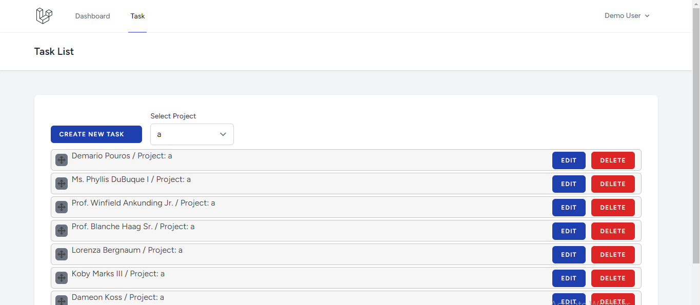

## System Requirements
- PHP: 8.1.*
- Composer: 2.5.4
- Node: 19.8.*

## Run Project
- For quick project setup choose sqlite database connection.
- Run command on terminal `composer install` to installs all PHP dependencies.
- Run command on terminal `php artisan app:project-setup` to set up project.

---

